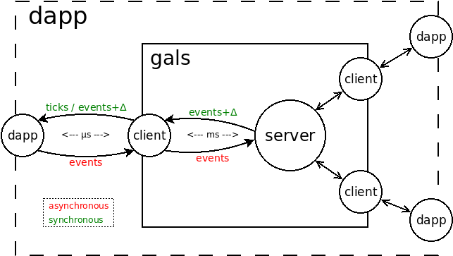

# GALS - Distributed Deterministic Applications

"Globally asynchronous locally synchronous (GALS)" is an architecture to
integrate multiple independent synchronous processes as a single distributed
application.

A synchronous process executes in steps (or *logical ticks*) as successive
reactions dictated by the external environment.
A logical tick may represent an event, such as a mouse click, or simply the
passage of time.
Since execution is guided from outside, the main advantage of the synchronous
model is that we can reproduce the exact behavior of a program by providing the
same sequence of steps.

Our goal is to have an application executing with the
*very same exact behavior* in multiples machines.
Whatever happens in one machine should be replicated in the others.
For instance, a mouse click in one machine should also occur in the other
machines at the time and position.
Our idea is to extend the synchronous execution model to a distributed setting.
If we can provide the same sequence of steps in all machines in real time, then
we can guarantee that all instances will behave exactly the same.

However, distributed processes execute under different environments, and thus
we cannot guarantee that logical ticks will be delivered in the exact same
order and time.
For instance, if the user clicks the mouse in one machine, this event needs to
travel to other machines, which will inevitably receive it in the future and at
different times.



The GALS architecture acknowledges that distributed processes are not
synchronized and that communication between them takes time, i.e., processes
are asynchronous to one another.
Our approach is to coordinate the processes transparently and delay the
occurrence of events so that the logical ticks are reproduced in real time in
the exact same way.
One important requirement is that the distributed application (`dapp`) must
be programmed as if it is a local synchronous application, with no explicit
communication with other processes in the network.

Our solution, entitled `gals`, relies on a central server to coordinate clients
that represent the distributed processes.
The client and server are always the same and are shipped with the `gals`
software distribution.
The actual `dapp` must be implemented by the user of `gals` and
communicates with the clients through a simple TCP API to receive and generate
events.
The `dapp` generates local events asynchronously (in read), but which are
received back globally and synchronously in all processes (in green).
We provide a sample `dapp` that just generates random events and dumps the
logical ticks in the screen.

## Install

First, you need to install `java`:

```
$ sudo apt install default-jre
```

Then, you are ready to install `gals`:

```
$ wget https://github.com/fsantanna-no/gals/releases/download/v0.2.0/install-v0.2.0.sh

# choose one:
$ sh install-v0.2.0.sh .                    # either unzip to current directory (must be in the PATH)
$ sudo sh install-v0.2.0.sh /usr/local/bin  # or     unzip to system  directory
```

## Execute

- Execute a `server` that expects `2` clients.
- Execute each `client` to generate ticks every `50ms` and communicate with
  the `dapp` through ports `9999` and `9998`.

```
$ gals server 2 &
$ gals client 9999 &
$ gals client 9998 &
```

- Open two other terminals to execute the default `dapp` and connect with the
  respective client.

```
$ gals app 9999 50
```

```
$ gals app 9998 50
```

- Observe that the apps behave in the very same way.

## A custom `dapp`

- The life cycle of a `dapp` is as follows:
    - Opens a connection with the local `client`.
    - Reads the logical ticks from the `client` in a blocking loop.
        - Updates the state of the application.
        - Generates events back to the `client` when appropriate.
- The `gals` system ensures that all instances receive the logical ticks in the
  same order.
- The default `dapp` written in Kotlin and shipped with the distribution is as
  follows:

```
fun app (port: Int, fps: Int) {
    // connects with the client on the provided port
    val socket = Socket("localhost", port)
    val writer = DataOutputStream(socket.getOutputStream()!!)
    val reader = DataInputStream(socket.getInputStream()!!)

    // sends the desired FPS
    writer.writeInt(fps)

    // thread that receives the logical ticks from the client
    thread {
        while (true) {
            val now = reader.readLong()     // current time
            val evt = reader.readInt()      // current event (0=none)

            // ... actual code that implements the application

            // here, we simply dump the current time/event
            when (evt) {
                0    -> println("now=$now")
                else -> println("now=$now evt=$evt")
            }

        }
    }

    // thread that emits random events back to the client
    thread {
        while (true) {
            Thread.sleep(Random.nextLong(5000))
            writer.writeInt(1 + Random.nextInt(10))
        }
    }
}
```
